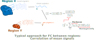

# MATLAB toolbox for ISAAC analysis of resting-state fMRI data

## Why ISAAC analysis?

ISAAC stands for Intra-Region structure and Asymmetric Covariation, which are aspects of brain activity that influence the estimation of functional connectivity.

The aim of this framework is to extend the study of functional connectivity between two brain regions from resting-state functional MRI data (rs-fMRI). The most common approach is estimating the functional connectivity as the linear correlation between the two regions' mean signals, as functional connectivity must lead to statistical dependency of their activity. However, correlation alone is ambiguous with respect to local activity properties (Friston, Brain Connect 2001; Cole et al, J. Neurosci. Methods 2016; Duff et al, NeuroImage 2018; Reid et al, Nat. Neuroscience 2019; Bijsterbosch et al, Nat. Neuroscience 2020), which arises from the formula of the linear correlation, which is the covariance between two regions' activity normalized by each region's activity standard deviation.

<p align="center">  </p>

The subtlety is that potential changes in the regions' variance that are unrelated to interactions between regions confound correlation, and thus the estimated functional connectivity. When one encounters a change in correlation between two conditions or two groups, one cannot be sure if that change comes from a change in covariance (between-region interactions) or a change in each region's local variance unrelated to actual functional connectivity, or a change in connectivity with a third region. Furthermore, a change in between-region connectivity, can be masked out by a change in a region's variance unrelated to that connectivity. Additionally, one can also see that, when using mean signals for functional connectivity, each region's variance is also dependent on its 'homogeneity', i.e. the correlation between voxels within the region. An increase in the mean signal's variance can be due to an increase in each voxel's activity, or to the activity of all the voxels being more "synchronized" (i.e. homogeneous).

Correlation alone cannot disambiguate changes in between-regions interactions that originate functional connectivity from changes in each region's local activity. This is something to account for in general in rs-fMRI, and might be especially important if alterations in local activity are expected (e.g. brain stimulation or medical conditions with focal alterations). The purpose of ISAAC analysis is to provide metrics that allow to disambiguate functional connectivity from correlation and local activity, as well as to estimate the underlying causes of variance, homogeneity and functional connectivity.

## Basic usage

Given some resting-state fMRI data, the ISAAC tool extracts local metrics from a set of regions, and shared metrics (e.g. correlation, shared variance) of selected pairs of regions. Thus, the inputs required are the time series, the definition of the regions of interest (rois), and the roi pairings for the analysis (i.e. which regions will be "compared" with which regions). To addapt for this implementation, the time series must be formatted as a data matrix in "column vector" form, i.e. a 2D matrix in which each column is the time series of a voxel. Each roi must be specified as a list of indices pointing to columns in the time series matrix, and all the rois stored in a structure.

A typical workflow would be to compute and save the metrics for each dataset (i.e. fmri data from a subject/session/run/trial).

```matlab

% compute for each subject/session/run
for k_dataset = 1:n_datasets

    % ---------------------------------------------------------------------
    % Do whatever to load each subject/session/run time series and rois.
    %
    % In this example the time series are stored in a variable called
    % 'tseries', a [M x N x P x T] matrix, where the fourth dimension is time.
    % The regions are variables called (roi1, roi2, ...), all as [M x N x P]
    % matrices, with 1 for the region and 0 for the background. 
    % ---------------------------------------------------------------------


    % ------------- addapt time series ------------------------------------
    tseries_shape = size(tseries);
    tseries = reshape(tseries, prod(tseries_shape(1:3)), tseries_shape(4));
    % convert to column vector form (#volumes x #voxels)
    tseries = tseries';


    % ------------- addapt rois -------------------------------------------
    rois = struct;
    rois.names = {'region1', 'region2', 'region3', 'region4', 'region5'};
    rois.idx = {find(roi1), find(roi2), find(roi3), find(roi4), find(roi5)};
    rois.as_x = [1, 2, 3];
    rois.as_y = [4, 5];

    % ------------- extract the metrics -----------------------------------
    % Compute and save as a .mat file:
    isaac_metrics = isaac_get_metrics(tseries, rois, 'file_out', <file_out>);

end

% concatenate all the metrics from all the datasets
isaac_metrics_all = isaac_concatenate(<isaac_files>, 'dataset_ids', <dataset_ids>, 'file_out', <file_concatenated>);

```

In this example we have specified two fields: as_x and as_y. This means that the shared metrics will be computed for all the regions specified by 'as_x' against all the regions specified by 'as_y' (i.e. we would not be interested in comparing region_1 with region_2). One can also run an "all against all" analysis by not specifying these fields. This can also be done for nifti files with the isaac_adapt_files function, provided that the nifti toolbox (https://es.mathworks.com/matlabcentral/fileexchange/8797-tools-for-nifti-and-analyze-image).

Further descriptions of the outputs and additional useful functionalities are documented in the function's help.

## The ISAAC descriptive metrics

The ISAAC descriptive approach simply consists of measuring homogeneity, variance and distant correlation. It is the simplest form of disambiguation, which is integrating metrics which affect the measured functional connectivity within the same mathematical formulation, so that they can be taken into account when interpreting the results. These three metrics can be measured with the same mathematical approach by averaging across voxels. Variance of a region is estimated as the mean variance of all its voxels, homogeneity as the mean correlation between pairs of voxels within the region, and distant correlation the mean correlation between pairs of voxels belonging to each region. If we have two regions named X and Y, the i-th voxel in X and the j-th of Y denoted as x_i and y_j, respectively:


<p align="center"> " alt="Var(X)=<Var(x_i)>"> </p>
<p align="center"> " alt="Var(Y)=<Var(y_j)>"> </p>

<p align="center"> " alt="Hom(X)=<Corr(x_i,x_j)>"> </p>
<p align="center"> " alt="Hom(Y)=<Corr(y_i,y_j)>"> </p>
<p align="center"> " alt="DCorr(Y)=<Corr(x_i,y_j)>"> </p>

Where <.> denotes averaging across all subindices.

## The ISAAC inferential metrics

ISAC stands for intra-region structure and asymetry of covariance, and attempts decompose the variance of each region's signals accounting for variance, homogeneity (intra-region structure) and between-region interactions (asymetric covariance). The approach is to define a model of BOLD activity which accounts separately for homogeneity and variance and to between-region interactions, and attempt to estimate the parameters of the model. Let's first define the model. Consider two regions named X and Y, the i-th voxel in X and the j-th of Y to account for homogeneity:

<p align="center">  </p>
<p align="center">  </p>

Thus the 'u' component is exclusive of each voxel (contributing positively to variance, but negatively to homogeneity) and the 'h' component is distributed across the region (contributing to variance and homogeneity). The 'e' component represents unstructured noise.

To account to between-region interactions, we model these as shared activity between regions (s_xy), and we can consider it to be homogeneous. The rest of the homogeneous activity of each of the two regions of interest does not reflect interactions, and we call it the independent activity. This distinction results in further dividing the 'h' component:

<p align="center">  </p>
<p align="center">  </p>

Which is the full ISAC model. The first term is the independent component in these expressions is only present in one of the regions, and thus doesn't represent between-region interactions (i.e. functional connectivity). The second term is the shared component, and is present in both regions, representing only between-region interactions. The 'Bx' coefficient is between (0-1), and allows the shared activity to be distributed non-symmetrically between the two regions, (e.g. because of a different coil sensitivity, or different neurovascular properties). 

The ISAC inferential metrics attempt to estimate how much do each of these components contribute to the measured signals, which can be acomplished by a variance decomposition procedure. Given the time series from all the voxels from two regions, these variances can be estimated from the data, obtaining the ISAC metrics:

<p align="center">  </p>
<p align="center">  </p>
<p align="center">  %2B <Var(e_{xi})>" alt="UVar(X)=<Var(u_{xi})> + <Var(e_{xi})>"> </p>
<p align="center">  %2B <Var(e_{yj})>" alt="UVar(Y)=<Var(u_{yj})> + <Var(e_{yj})>"> </p>
<p align="center">  </p>
<p align="center">  </p>
<p align="center">  </p>

Which represent the homogeneous and unstructured variances (HVar and UVar), and the shared and independent variances (SVar and IVar).


## Acknowledgement
If you use this data in a publication, please cite:

J Caballero-Insaurriaga, JA Pineda-Pardo, I Obeso, A Oliviero & G Foffani, Non-invasive modulation of human corticostriatal activity. Proceedings of the National Academy of Sciences of the United States of America (2023) doi: 10.1073/pnas.2219693120
